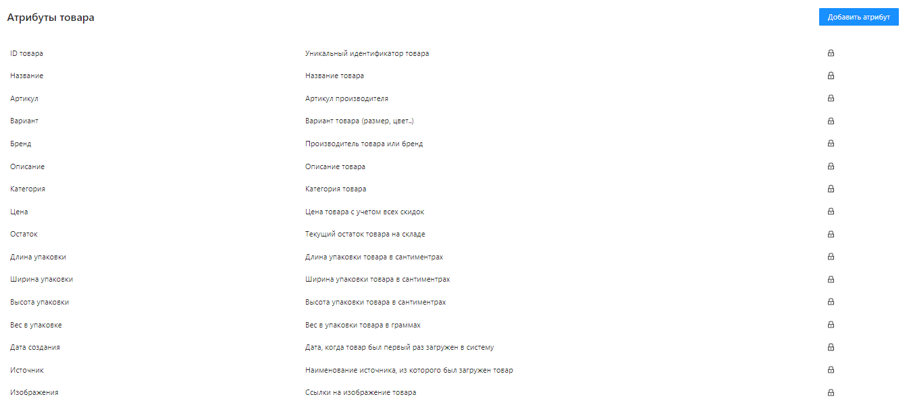

---
layout: default
title: Что такое атрибуты системы?
---

# Что такое атрибуты системы?

**Атрибут системы** - это внутренний атрибут товара, который описывает какую-либо характеристику товара, будь это цена, производитель или размер. Так же атрибутами являются название источника данных, даты создания в каталоге и многие другие особенности товара. По каждому атрибуту можно осуществлять поиск и использовать его экспорте данных на любые площадки. Атрибуты могут содержать “объединенные” или вычисленные данные, нужные для публикации.

Значение атрибутам системы задаются при помощи соответствий между полями и правил во время импорта ваших данных из источников. При экспорте атрибуты используются для вычисления соответствующих значений полей экспорта в зависимости от требований каждого из маркетплейсов или форматов данных.

По умолчанию в системе есть несколько базовых атрибутов, но при необходимости можно создать неограниченное количество атрибутов, описывающих свойства товара.

Новые атрибуты могут быть добавлены во вкладку “Характеристики” товара в каталоге.

