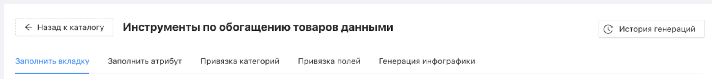
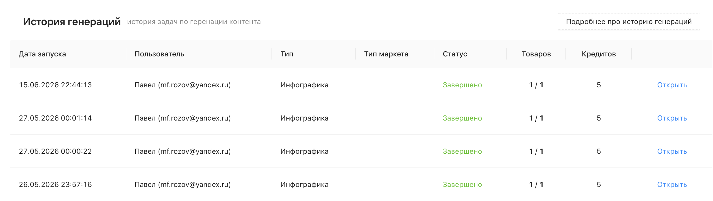
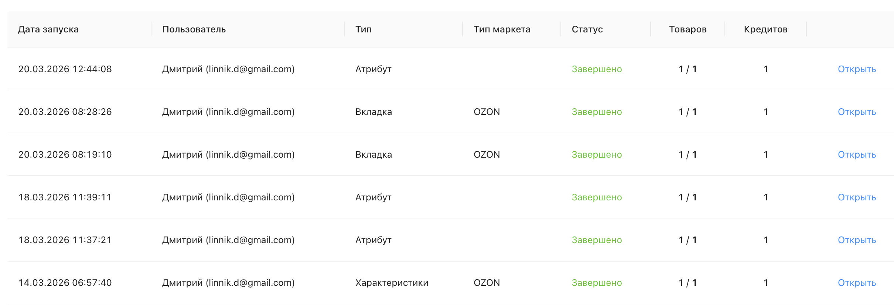
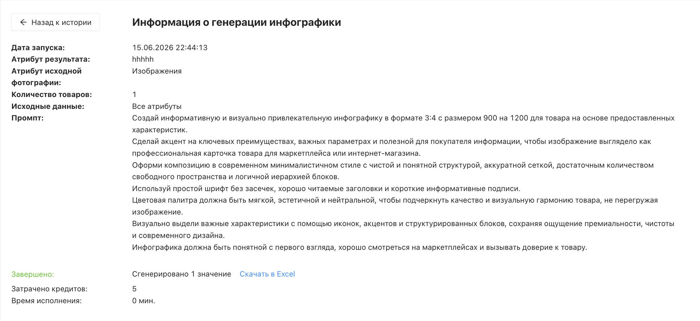

# Что такое история генераций?

История генераций – это журнал всех задач, запущенных через инструменты каталога: [«Заполнить вкладку»](https://docs.databird.ru/instrument-zapolnit-vkladky/), [«Заполнить атрибут»](https://docs.databird.ru/instrument-zapolnit-atribut/), [«Привязка категорий»](https://docs.databird.ru/instrument-privyazka-kategoriy/), [«Привязка полей»](https://docs.databird.ru/instrument-privyazka-poley/) и [«Генерация инфографики»](https://docs.databird.ru/ССЫЛКА-НА-СТАТЬЮ/), а также некоторые инструменты генерации в обычных экспортах. Здесь можно отслеживать статусы задач, контролировать расход кредитов и при необходимости скачивать результаты генерации в табличном формате xlsx.

 

## Где найти историю генераций?

Перейдите в раздел "Каталог товаров" → кнопка "Инструменты" → кнопка **"История генераций"** в правом верхнем углу.

 

## Что отображается в истории?

Каждая запись в таблице содержит:

* _**Дата запуска**_ – дата и время, когда была запущена задача
* _**Пользователь**_ – кто из пользователей проекта запустил задачу
* _**Тип**_ – какой инструмент был использован: Вкладка, Атрибут, Инфографика и т.д.
* _**Тип маркета**_ – маркетплейс, для которого выполнялась задача (заполняется для инструментов, где выбирается вкладка)
* _**Статус**_ – результат выполнения задачи: «Завершено» или «Ошибка»
* _**Товаров**_ – сколько товаров было обработано из общего числа
* _**Кредитов**_ – сколько кредитов было списано за задачу

❕ Кредиты списываются не за каждую задачу – только за те инструменты, которые их расходуют

 

## Подробная информация о задаче

Нажмите **"Открыть"** напротив любой записи, чтобы посмотреть детали задачи: использованные настройки, промпт, количество обработанных товаров и затраченные кредиты.

Там же доступна кнопка **"Скачать в Excel"** с результатами генерации. Это полезно, если данные, записанные в каталог, были впоследствии изменены или перезаписаны – вы всегда сможете восстановить исходный результат генерации из файла.

 

## Статусы задач

* _**В работе**_ – идет генерация, нужно немного подождать
* _**Завершено**_ – задача выполнена успешно
* * _**Ошибка**_ – в процессе выполнения возникла проблема. Откройте запись, чтобы узнать подробнее о причине

❕ Если задача завершилась с ошибкой, кредиты не списываются
