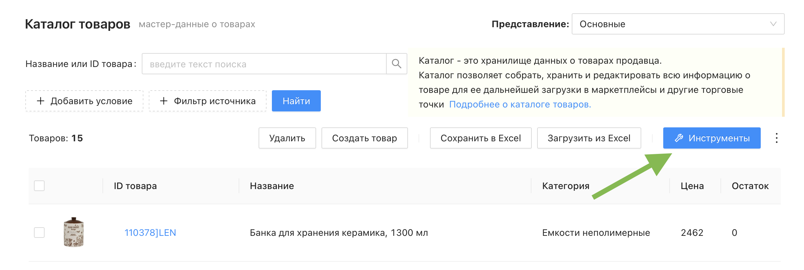

# Инструменты каталога

Инструменты – это раздел для массового обогащения товаров во вкладках данными с помощью нейросети. Они позволяют автоматически заполнять карточки товаров, привязывать категории и настраивать соответствие полей без ручной обработки каждого товара вручную.
 
 

## Как открыть инструменты?

Перейдите в раздел "Каталог товаров", фильтрами выберите нужные товары (или оставьте без выбора) и нажмите синюю кнопку "Инструменты" в правом верхнем углу списка товаров.

 

## Какие инструменты есть?

На данный момент DataBird предоставялет четыре инстурмента по работе с товарами предсталений, каждый находится в своем разделе:

* _**Заполнить вкладку**_ – нейросеть автоматически заполняет все основные поля карточки товара для выбранного маркетплейса: категорию, название, описание, характеристики и габариты
* _**Заполнить атрибут**_ – нейросеть заполняет один конкретный атрибут каталога на основе вашего промпта. Подходит для нестандартных задач
* _**Привязка категорий**_ – позволяет вручную задать соответствие между категориями каталога и категориями маркетплейса. Не расходует кредиты проекта
* _**Привязка полей**_ – настраивает соответствие между полями экспорта маркетплейса и атрибутами каталога. Не расходует кредиты проекта
 
 

⚠️ Инструменты "Заполнить вкладку" и "Заполнить атрибут" используют нейросеть и расходуют кредиты проекта

⚠️ Инструменты "Привязка категорий" и "Привязка полей" идентичны процессам привязок в экспортах, работают без расхода кредитов
