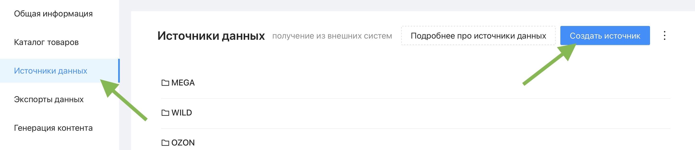
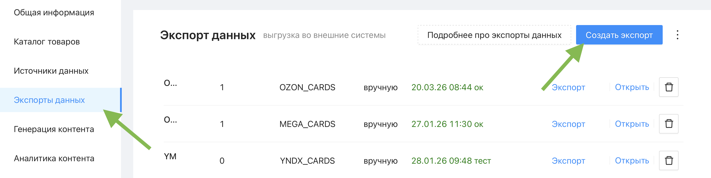

# Что такое источник данных и экспорт?

В Databird весь поток данных о товарах строится на двух понятиях: **источник данных** и **экспорт**. Источник отвечает за то, откуда приходят данные в каталог, экспорт - за то, куда они уходят.

 

## Источник данных

**Импорт данных** - процесс загрузки данных о ваших товарах в систему Databird.

Для каждого импорта создаётся **источник данных** - настроенное подключение к внешнему поставщику данных. Это может быть файл Excel, фид от поставщика, выгрузка из 1С или маркетплейс. После настройки источника товары из него попадают в каталог Databird и становятся доступны для редактирования и выгрузки.

Все источники данных находятся в разделе меню **"Источники данных"**. Чтобы создать новый источник, нажмите кнопку **"Создать источник"**.

 

## Экспорт данных

**Экспорт данных** - процесс выгрузки данных во внешний источник (маркетплейсы, 1С, файлы).

Для каждой выгрузки создаётся **экспорт** - настроенное подключение к торговой площадке или другому каналу сбыта. Экспорт определяет, какие товары, в каком формате и на какую площадку передаются из каталога Databird.

Все экспорты находятся в разделе меню **"Экспорты данных"**. Чтобы создать новый экспорт, нажмите кнопку **"Создать экспорт"**.

