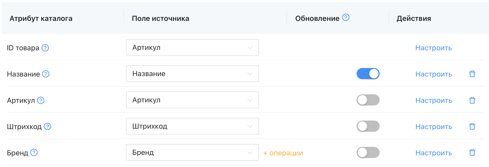
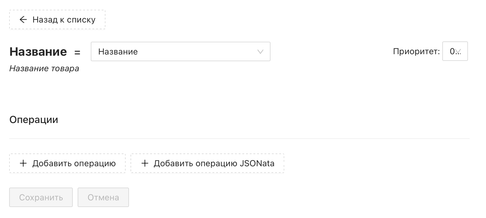

# Что такое правила?

**Операция** (она же **Правило**) - это выражение, которое приравнивается атрибуту системы Databird. Используя логику заданного выражения, Databird будет вычленять и сопоставлять данные ваших импортов и экспортов. 

Чтобы задать правило необходимо нажать на кнопку "Настройки" рядом с интересующим вас атрибутом в источнике или экспорте данных

❕Если у атрибута заданы какие-либо операции - в общем списке он будет помечен припиской "_+ операции_"

 

## Виды правил
Правила делятся на 2 типа: Базовые и JSONata

Подробнее про базовые операции: https://docs.databird.ru/bazovye-operacii/

Для написания же сложного JSONata правила (логики) используется язык JSONata

🧩 Официальная документация языка JSONata на английском языке: [http://docs.jsonata.org/](http://docs.jsonata.org/)

 
 

🔗 **Связанные разделы**:

[Базовые операции](/bazovye-operacii/)

[Настройка правил загрузки](/nastroyka-pravil-zagruzki/)

[Настройка правил экспорта](/nastroyka-pravil-eksporta/)

