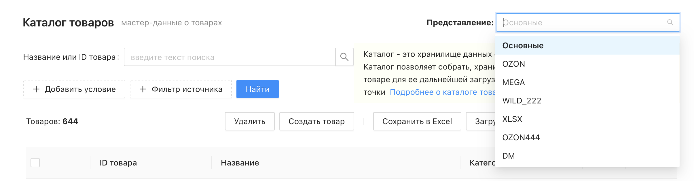
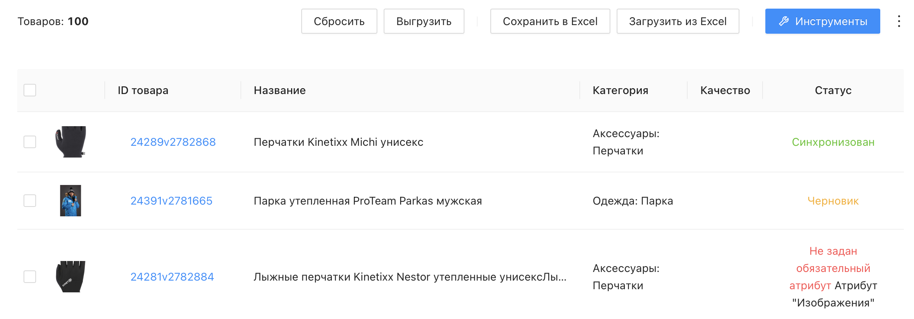
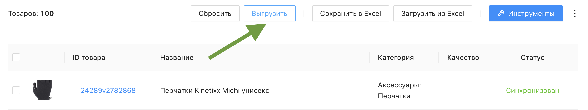

# Что такое представление?

**Представление** – это рабочее пространство для подготовки товаров и контроля их синхронизации с конкретным маркетплейсом или форматом выгрузки. Представление позволяет собирать, хранить и редактировать информацию о товарах, заточенную под требования отдельной площадки, а также отслеживать статус её синхронизации.

По сути, представление – это режим просмотра каталога через призму одной конкретной [вкладки](https://docs.databird.ru/chto-takoe-vkladka/): при выборе представления каталог показывает товары с их атрибутами именно этой вкладки, а не основными атрибутами.

 

## Где найти представления?

Переключить представление можно в правом верхнем углу страницы "Каталог товаров", в выпадающем списке **"Представление"**. По умолчанию выбрано представление **"Основные"** – оно показывает основные атрибуты товара (вкладку "Характеристики"). Остальные пункты списка соответствуют вкладкам, созданным в проекте.

❕ Товар появляется в каком-либо представлении только после того, как у него появляется соответствующая вкладка – подробнее об этом в статье [«Что такое вкладка?»](https://docs.databird.ru/chto-takoe-vkladka/).

 

## Что можно делать в представлении?

В представлении доступны те же базовые возможности, что и в обычном каталоге: поиск, фильтрация, сохранение в Excel, загрузка из Excel и инструменты обогащения данных.

Дополнительно для каждого товара в представлении отображается статус синхронизации с маркетплейсом:

* _**Черновик**_ – товар ещё не выгружался либо был измене, те рассинхронизирвоан с источником/маркетом
* _**Синхронизирован**_ – данные товара совпадают с источником/маркетом
* _**Ошибка**_ – при выгрузке (синхронизации) возникла проблема
* _**Синхронизация**_ – товар в процессе выгрузки

 

## Как происходит синхронизация?

Основной способ синхронизации – **массовая синхронизация** прямо из представления: выберите нужные товары в каталоге и запустите синхронизацию для всех выбранных сразу. Это самый быстрый способ выгрузить или обновить большое количество товаров на маркетплейсе одним действием.

⚠️ Обратите внимание, что при выгрузке на маркет уходят только поля помеченные желтой дискетой (не синхронизированные поля)

Также можно синхронизировать товар по одному – прямо внутри его карточки в нужном представлении доступна кнопка **"Выгрузить"**, которая запускает экспорт данных этой вкладки товара на маркетплейс.

Подробнее о настройке вкладки источника – в статье [«Настройки вкладки источника»](https://docs.databird.ru/nastroyki-vkladki/).
