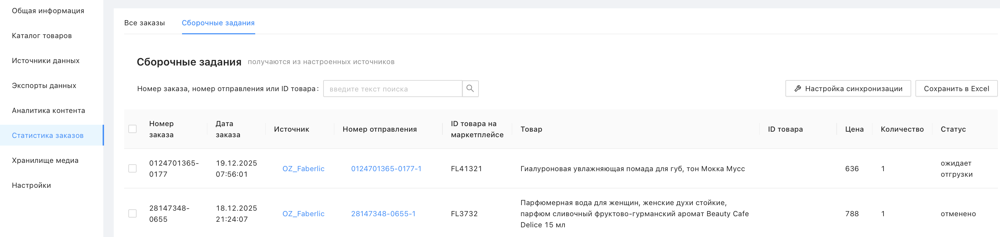
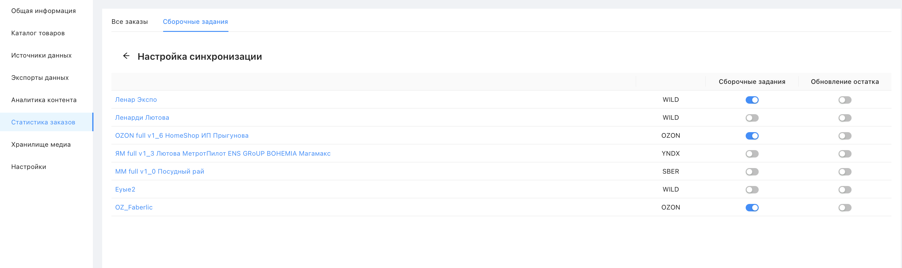

# Что такое сборочные задания?

Сборочные задания – это раздел внутри «Статистики заказов», где отображаются активные отправления в рамках заказов. Сервис опрашивает источники каждые 5 минут и подтягивает активные заказы за последние 4 дня. В отличие от вкладки «Все заказы», здесь каждая строка – это конкретное отправление со своим номером и статусом доставки.

Для каждого отправления отображается: номер заказа, дата, источник, номер отправления, ID товара на маркетплейсе, товар, ID товара в каталоге Databird, цена, количество и статус (например, «ожидает отгрузки», «доставляется», «отменено»).

Соответствие между товарами в заказах и товарами в каталоге Databird устанавливается на основе поля, указанного в настройках источника – обычно это ID товара или штрихкод.

 

## Настройка синхронизации и обновление остатков

По кнопке **"Настройка синхронизации"** можно выбрать, для каких источников включить сборочные задания, а также настроить **"Обновление остатка"**.

Если обновление остатка включено – при появлении нового заказа количество товара в каталоге Databird автоматически уменьшается на проданное количество, после чего новое значение остатка отправляется на все синхронизируемые маркетплейсы. Это позволяет поддерживать актуальные остатки сразу на всех площадках без ручного вмешательства или сохдания дополнительных экспортов.

⚠️ Для коррекной работы синхронизации остатков в настройках подключенных истчоников должны быть запонены поля с id складов, которые по-умолчанию являются необязательными к заполнению

 

## Выгрузка в Excel

Кнопка **"Сохранить в Excel"** позволяет скачать таблицу со сборочными заданиями. За раз выгружаются последние 10 000 записей.

 

## Доступ по API

Данные о сборочных заданиях из Databird можно забирать по API. Подробнее – [в статье](https://databirds.notion.site/Databird-e686ec86beda4ce8ad42b9d2a7770f2c)
