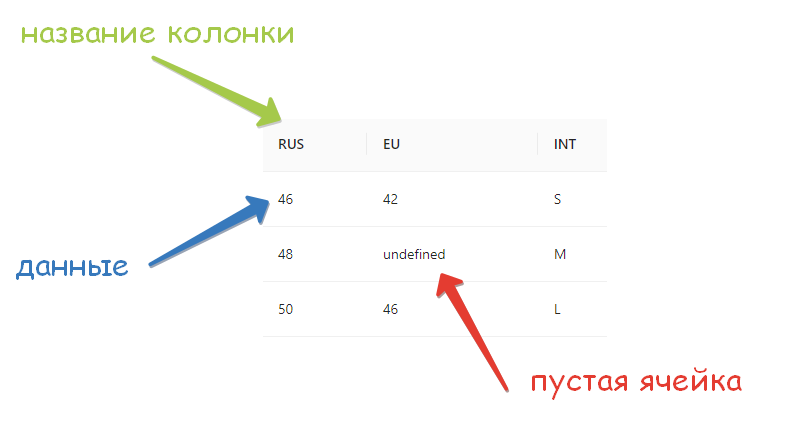

---
layout: default
title: Что такое словари?
---

# Что такое словари?

Словарь - удобный инструмент для хранения и перевода данных из одного формата в другой. Использование словарей сильно облегчает написание правил. 

Словарь имеет табличный вид, где первая строка содержит в себе названия колонок, а начиная со второй строки, в этих колонках находятся соответствующие данные.

❕Если, во время заполнения словаря, в ячейку данных не было занесено никакой информации, после создания словаря, она становится пустой ячейкой, принимая значение undefined.

🔗 ****Связанные разделы:

[Создание и редактирование словарей](sozdanie-i-redaktirovanie-slovarey/)

[Работа со словарями](rabota-so-slovaryami/)

