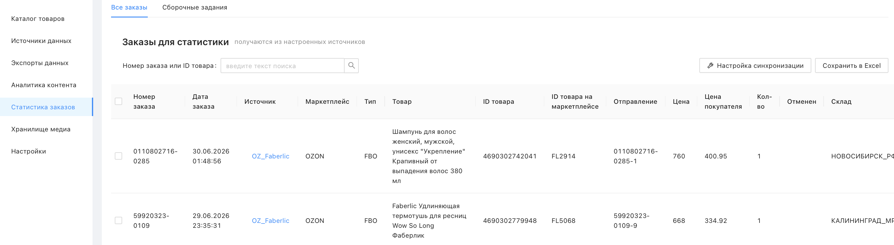
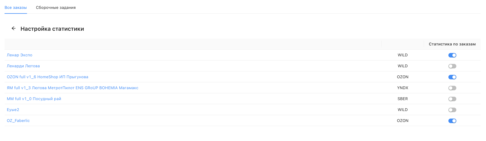

# Что такое статистика заказов?

Статистика заказов – это раздел Databird, где в едином унифицированном виде собираются данные о заказах с подключённых маркетплейсов: OZON, Wildberries, МегаМаркет и Яндекс Маркет. Сервис автоматически опрашивает источники раз в сутки и подтягивает заказы за последние 21 день.

❕ Раздел доступен после подключения – обратитесь к менеджеру или в техническую поддержку.

Для каждого заказа в таблице отображается: номер и дата заказа, источник, маркетплейс, тип (FBO/FBS), товар, ID товара, ID на маркетплейсе, цена, цена покупателя, количество, склад. Для каждой проданной позиции создаётся отдельная запись.

 

## Настройка синхронизации

По кнопке **"Настройка синхронизации"** можно выбрать, для каких источников включить получение данных о заказах.

 

## Выгрузка в Excel

Кнопка **"Сохранить в Excel"** позволяет скачать таблицу с заказами. За раз выгружаются не более 10 000 последних записей из таблицы.

 

## Доступ по API

Данные о заказах из Databird можно забирать по API. Подробнее – [в статье](https://databirds.notion.site/Databird-e686ec86beda4ce8ad42b9d2a7770f2c)
