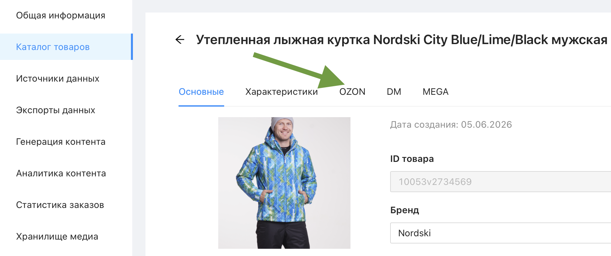
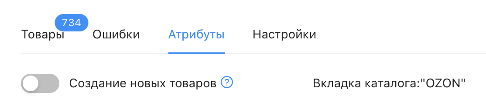

# Что такое вкладка?

**Вкладка** – это отдельный набор атрибутов товара, заточенный под требования конкретного маркетплейса (OZON, Wildberries, Яндекс Маркет и т.д.) или формата выгрузки. У каждой вкладки – собственное уникальное имя и собственный набор атрибутов, не пересекающийся с атрибутами других вкладок.

Помимо вкладок маркетплейсов, в каталоге всегда присутствует вкладка **"Характеристики"** – она относится к основным атрибутам товара и не привязана к конкретной площадке.

 

## Зачем нужны вкладки?

Один и тот же товар часто нужно продавать на нескольких площадках одновременно, а у каждой площадки – свои требования к названию, характеристикам и набору полей. Вкладки позволяют хранить эти данные раздельно: значения атрибутов одной вкладки никак не влияют на значения атрибутов другой, даже если атрибуты называются одинаково (например, "Цвет" во вкладке OZON и "Цвет" во вкладке WILD – это два разных, независимых значения).

 

## Как вкладка связана с источником?

Вкладку можно привязать к [источнику данных](https://docs.databird.ru/istochniki-dannyh/) – тогда она будет получать и обновлять значения атрибутов из этого источника при каждой синхронизации.

❗️ Одна вкладка может быть привязана только к одному источнику. При удалении источника привязанная к нему вкладка также удаляется.

 

## Как товар получает вкладку?

Чтобы у товара появилась вкладка (и он, соответственно, попал в соответствующее представление), должно произойти одно из следующих событий:

* товар был загружен из источника к которому привязана вкладка
* для товара был запущен инструмент [«Заполнить вкладку»](https://docs.databird.ru/instrument-zapolnit-vkladky/)
* данные вкладки товара были загружены вручную через Excel прямо в представлении

 

## Где настраиваются вкладки?

Вкладки создаются и настраиваются в разделе "Настройки" → "Атрибуты". Подробнее о создании и настройке вкладок – в статье [«Настройки вкладки источника»](https://docs.databird.ru/nastroyki-vkladki/).
