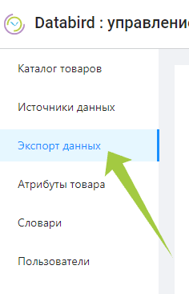

---
layout: default
title: Экспорты данных
---

# Экспорты данных

Для создания нового экспорта следует в левом окне сайта выбрать вкладку **“Экспорт данных”**.

На отрывшейся странице будут видны уже имеющиеся экспорты. За  создание нового экспорта отвечает кнопка *“Добавить экспорт”* в правом верхнем углу страницы.

В открывшемся окне *“Выберите получателя данных”* из представленного списка необходимо выбрать тип экспорта (формат в который будет произведен экспорт данных) и подтвердить выбор щелчком по кнопке “Выбрать”.

## Создание экспорта на маркетплейс Ozon

Databird поддерживает три вида экспорта на маркетплейс Ozon:

- OZON_CARD - выгрузка карточек товаров (со всей информацией о товаре)
- OZON_STOCKS - выгрузка остатков товаров
- OZON_PRICES - выгрузка цен товаров

При создании которых необходимо заполнить следующие обязательные поля и нажать кнопку “Создать”.

.png)

## Создание экспорта на маркетплейс **Вайлдберриз (Wildberries)**

Databird поддерживает три вида экспорта на маркетплейс Wildberries:

- WILD_CARD - выгрузка карточек товаров (со всей информацией о товаре)
- WILD_STOCKS - выгрузка остатков товаров
- WILD_PRICES - выгрузка цен товаров

При создании которых необходимо заполнить следующие обязательные поля и нажать кнопку “Создать”.

.png)

## Создание экспорта на маркетплейс Яндекс Маркет

Databird поддерживает четыре вида экспорта на маркетплейс Яндекс Маркет:

- YNDX_CARD - выгрузка шаблонов карточек
- YNDX_GOODS - выгрузка ассортимента товаров
- YNDX_STOCKS - выгрузка остатков товаров
- YNDX_PRICES - выгрузка цен товаров

При создании которых необходимо заполнить следующие обязательные поля и нажать кнопку “Создать”.

.png)

## Создание экспорта на маркетплейс СберМегаМаркет

Databird поддерживает один вида экспорта на маркетплейс СберМегаМаркет:

- SBER_STOCKS - выгрузка остатков товаров

При создании которых необходимо заполнить следующие обязательные поля и нажать кнопку “Создать”.

.png)

## Создание экспорта в файл

Databird поддерживает два экспорт в два вида файлов:

- YML_FILE - выгрузка карточек, цен и остатков товаров в формате YML
    
    
    

- JSON_FILE - выгрузка карточек товаров карточек, цен и остатков в формате JSON

При создании которых необходимо заполнить следующие обязательные поля и нажать кнопку “Создать”.

Щелчком мыши по кнопке *“Открыть”* или по названию созданного только что экспорта, перейдем внутрь шаблона для дальнейших настроек.

Экспорт товаров происходит из общего каталога Databird с использованием фильтров. Добавить фильтр можно щелчком по одноименной кнопке.

📎 Подробнее о фильтрах и их использовании:

[Настройка фильтров](%D0%9D%D0%B0%D1%81%D1%82%D1%80%D0%BE%D0%B9%D0%BA%D0%B0%20%D1%84%D0%B8%D0%BB%D1%8C%D1%82%D1%80%D0%BE%D0%B2%2067018db9aca848158452fe98eb821a4f.md)

Если для экспорта вам нужна более тонкая настройка, чем та, которую предоставляют фильтры, то в поле *“Условия”* ( находится во вкладке “Настройки”) можно задать условия которые будут выполняться при экспорте (после работы фильтров). Условия задаются с использованием языка JSONata. Это поле не является обязательным для заполнения.

