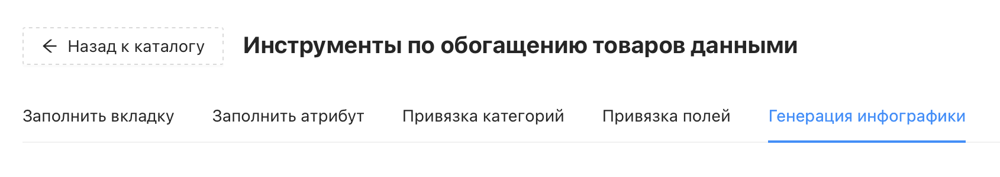
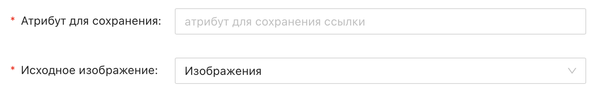
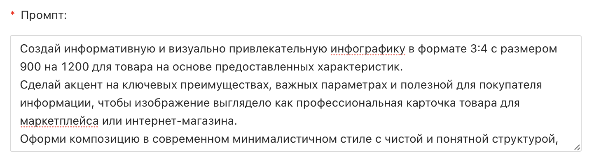
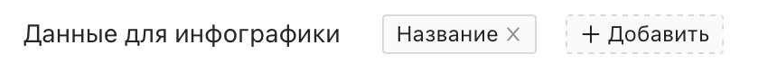
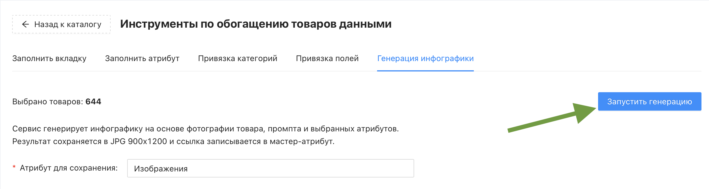

# Инструмент "Генерация инфографики"

Инструмент "Генерация инфографики" автоматически создаёт инфографику товара на основе его фотографии, выбранных атрибутов и промпта. Результат сохраняется в формате JPG 900×1200 в хранилище медиа-контента, а ссылка на файл записывается в указанный атрибут товара.

❇️ Инструмент **расходует** кредиты проекта. Генерация инфографики для одного товара затрачивает **5 кредитов**. При неудачной генерации кредиты не будут списаны<br>

<br>

## Где найти инструмент?

Перейдите в раздел "Каталог товаров" → кнопка "Инструменты" → вкладка "Генерация инфографики"




<br>

## Настройки инструмента

### Обязательные настройки

Обязательные настройки помечены красной звёздочкой.




У инструмента "Генерация инфографики" их три:
* _**Атрибут для сохранения**_ – атрибут, в который будет записана ссылка на сгенерированную инфографику. Выбирается из атрибутов основного представления. Если нужного атрибута ещё нет – просто введите его название в поле, и он будет создан автоматически

  ⚠️ Не рекомендуется выбирать в качестве атрибута для сохранения тот же атрибут, из которого берётся исходное изображение. При записи результата все остальные ссылки на изображения в этом атрибуте будут удалены – останется только ссылка на сгенерированную инфографику
* _**Исходное изображение**_ – атрибут, из которого нейросеть возьмёт фотографию товара. Используется только первое изображение из атрибута

  ❕ Нейросеть при необходимости может автоматически убрать фон фотографии, оставив только товар. Если это важно – явно укажите это в промпте, либо, напротив, попросите сохранить фон
* _**Промпт**_ – инструкция для нейросети, описывающая желаемый стиль и содержание инфографики. По умолчанию задан наш универсальный промпт, который даёт хороший результат в большинстве случаев. Вы всегда можете отредактировать его или написать собственный промпт с нуля под вашу задачу

```
Создай информативную и визуально привлекательную инфографику в формате 3:4 с размером 900 на 1200 для товара на основе предоставленных характеристик. Сделай акцент на ключевых преимуществах, важных параметрах и полезной для покупателя информации, чтобы изображение выглядело как профессиональная карточка товара для маркетплейса или интернет-магазина. Оформи композицию в современном минималистичном стиле с чистой и понятной структурой, аккуратной сеткой, достаточным количеством свободного пространства и логичной иерархией блоков. Используй простой шрифт без засечек, хорошо читаемые заголовки и короткие информативные подписи. Цветовая палитра должна быть мягкой, эстетичной и нейтральной, чтобы подчеркнуть качество и визуальную гармонию товара, не перегружая изображение. Визуально выдели важные характеристики с помощью иконок, акцентов и структурированных блоков, сохраняя ощущение премиальности, чистоты и современного дизайна. Инфографика должна быть понятной с первого взгляда, хорошо смотреться на маркетплейсах и вызывать доверие к товару.
```

<br>

### Остальные настройки



* _**Данные для инфографики**_ – атрибуты товара, данные из которых нейросеть будет использовать при создании инфографики. Поле необязательное: если оставить его пустым, нейросеть будет учитывать абсолютно все атрибуты товара. Если же вы указываете конкретные атрибуты – рекомендуем всегда включать в список **Название** (оно выбрано по умолчанию). Без него нейросеть может неверно определить товар по фото: например, если вы продаёте спортивные штаны, а нейросеть при геенрации может принять за товар весь спортивный костюм на фото

<br>

## Запуск генерации



Когда все настройки заданы, нажмите синюю кнопку **"Запустить генерацию"** в правом верхнем углу. Появится предупреждение о списании кредитов проекта – подтвердите его.

После подтверждения откроется страница раздела "Генерация контента", где можно отслеживать статус текущей генерации в режиме реального времени. По окончании там же будет доступна итоговая информация:

* Затраченное время
* Количество обработанных товаров и списанных кредитов
* Файл Excel с результатами генерации

⚠️ Сгенерированные изображения сохраняются в [хранилище медиа-контента](https://docs.databird.ru/media/). Следите за свободным местом в хранилище – при его переполнении генерация будет недоступна
