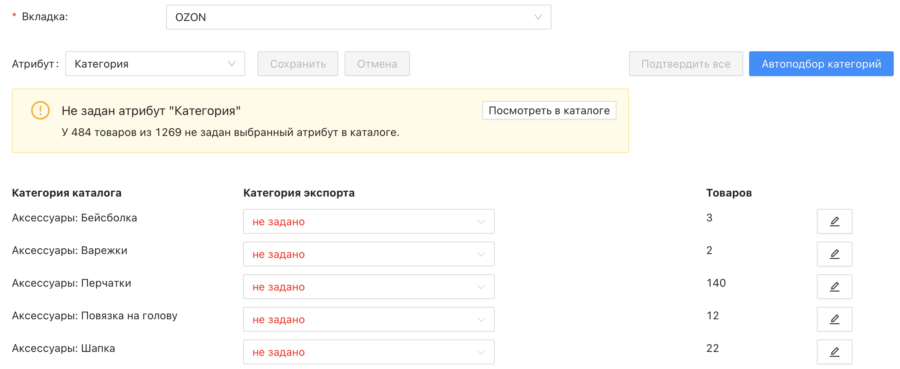
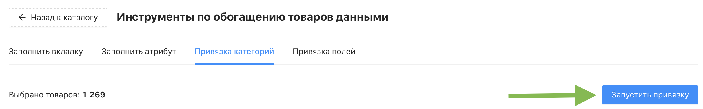

# Инструмент "Привязка категорий"

Инструмент "Привязка категорий" позволяет вручную задать соответствие между категориями вашего каталога и категориями маркетплейса выбранной вкладки. Используйте его, если автоподбор категорий предложил неверный вариант или если хотите зафиксировать нужные соответствия заранее.

❎ Инструмент **не расходует** кредиты проекта
 
 

## Где найти инструмент?

Перейдите в раздел "Каталог товаров" → кнопка "Инструменты" → раздел "Привязка категорий"

## Настройки инструмента

### Обязательные настройки

Обязательные настройки помечены красной звёздочкой, их заполнение является обязательным.

У инструмента "Привязка категорий" она одна:

- ***Вкладка*** – выберите вкладку каталога (маркетплейс), для которой нужно настроить привязку категорий. После выбора в таблице ниже отобразятся все категории вашего каталога, включая ранее заданные соответствия категориям выбранного маркетплейса в рамках этого иструмента и вкладки
 

## Привязка категорий

Процесс привязки категорий полностью идентичен процессу в экспорте.

📎 Подробнее читайте в статье [Связывание категорий](https://docs.databird.ru/svyazyvanie-kategoriy/)

⚠️ Без корректной привязки категорий выгрузка товаров на маркетплейс невозможна
 
 

## Запуск привязки

Когда все настройки заданы, нажмите синюю кнопку "Запустить привязку" в правом верхнем углу. Появится предупреждение о перезаписи категорий для выбранных товаров – подтвердите его.

После подтверждения откроется страница раздела меню "Генерация контента", где можно отслеживать статус привязки в режиме реального времени. По окончании там же будет доступна итоговая информация:

- Затраченное время
- Количество обработанных товаров
- Файл Excel с результатами
