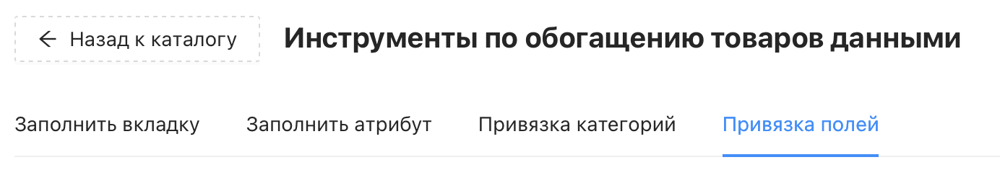
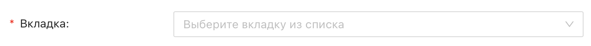
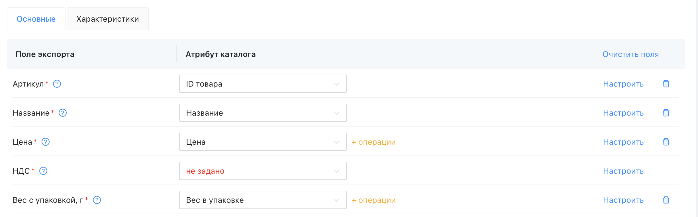
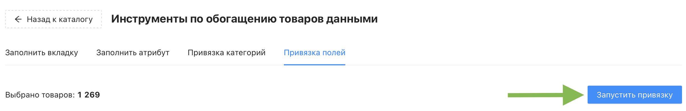

# Инструмент "Привязка полей"

Инструмент "Привязка полей" позволяет настроить соответствие между полями экспорта маркетплейса и атрибутами вашего каталога. После выбора вкладки загружаются ранее сохранённые правила привязки.

❇️ Инструмент не расходует кредиты проекта
 
 

## Где найти инструмент?

Перейдите в раздел "Каталог товаров" → кнопка "Инструменты" → раздел "Привязка полей"

## Настройки инструмента

### Обязательные настройки

Обязательные настройки помечены красной звёздочкой, их заполнение является обязательным.

У инструмента "Привязка полей" она одна:

- ***Вкладка*** – выберите вкладку каталога (маркетплейс), для которой нужно настроить привязку полей. После выбора загрузятся ранее сохранённые правила привязки для этой вкладки
 

## Привязка полей

Процесс привязки полей полностью идентичен процессу настройки правил в экспорте.

🖇️ Подробнее читайте в статье [Настройка правил экспорта](https://docs.databird.ru/nastroyka-pravil-eksporta/)
 

⚠️ Поля, отмеченные красной звёздочкой, являются обязательными – без их заполнения выгрузка товаров на маркетплейс невозможна
 

## Запуск привязки

Когда все настройки заданы, нажмите синюю кнопку "Запустить привязку" в правом верхнем углу. Появится предупреждение о перезаписи привязок полей для выбранных товаров – подтвердите его.

После подтверждения откроется страница раздела меню "Генерация контента", где можно отслеживать статус привязки в режиме реального времени. По окончании там же будет доступна итоговая информация:

- Затраченное время
- Количество обработанных товаров
- Файл Excel с результатами

