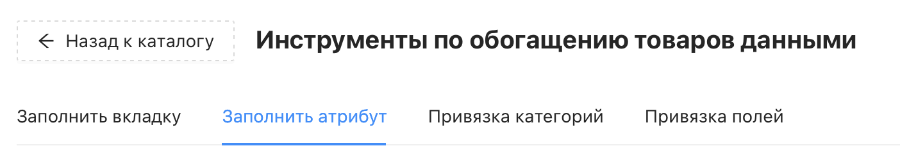
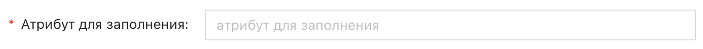
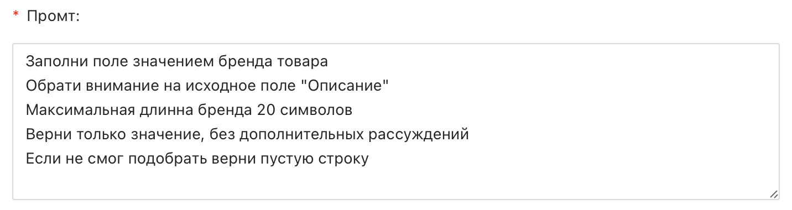
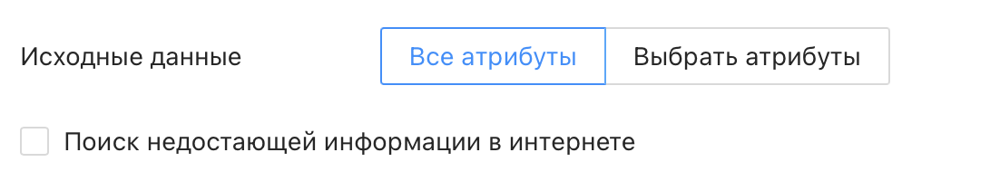
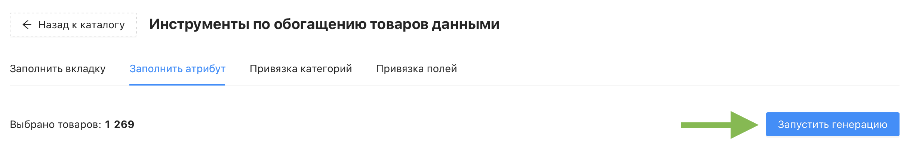

# Инструмент «Заполнить атрибут»

Инструмент "Заполнить атрибут" автоматически заполняет выбранный атрибут товара на основе вашего промта. Подходит для нестандартных задач: извлечения бренда из описания, формирования кода цвета, составления краткого заголовка и других случаев, когда стандартной генерации недостаточно.

❇️ Инструмент **расходует** кредиты проекта. Генерация данных для одного товара затрачивает один кредит. При неудачной генерации для товара кредит не будет списан
 
 

## Где найти инструмент?

Перейдите в раздел "Каталог товаров" → кнопка "Инструменты" → раздел "Заполнить атрибут"

## Настройки инструмента

### Обязательные настройки

Обязательные настройки помечены красной звёздочкой, их заполнение является обязательным.

У инструмента «Заполнить атрибут» их две:

- ***Атрибут для заполнения*** – выберите атрибут каталога, который нейросеть должна заполнить. Если атрибут уже заполнен – его значения будут обновлены
- ***Промт*** – текстовая инструкция для нейросети. Именно на основе промта нейросеть понимает как ей правильно генерировать значение атрибута. Чем точнее промпт – тем точнее результат. Рекомендации:
  * Чётко укажите, что именно нужно сделать и какое значение вернуть
  * * Используйте точные названия исходных атрибутов в кавычках
  * Задайте ограничения: длину, формат, допустимые значения
  * Попросите вернуть пустую строку при оширбке генерации
  * Попросите избегать ненужных рассуждений
 

### Остальные настройки

- ***Исходные данные*** – отвечает за выбор, какие атрибуты каталога нейросеть будет использовать как источник. По умолчанию передаются все атрибуты товара. Если нужно ограничить контекст – переключитесь на настройку «Выбрать атрибуты» и выберите конкретные атрибуты вручную через кнопку «+ Добавить»
- ***Поиск недостающей информации в интернете*** – если включено, нейросеть будет дополнительно искать данные о товаре в сети. Полезно, если в каталоге мало исходных данных. По умолчанию выключено
 

## Запуск генерации

Когда все настройки заданы, нажмите синюю кнопку "Запустить генерацию" в правом верхнем углу. Появится предупреждение о списании кредитов проекта и перезаписи значений атрибута для выбранных товаров – подтвердите его.

После подтверждения откроется страница раздела меню "Генерация контента", где можно отслеживать статус текущей генерации в режиме реального времени. По окончании там же будет доступна итоговая информация:

- Затраченное время
- Количество обработанных товаров и списанных кредитов
- Файл Excel с результатами генерации
 

⚠️ Результаты генерации рекомендуется проверить перед использованием – нейросеть может ошибиться, если исходные данные товара неполные или промпт сформулирован недостаточно точно
