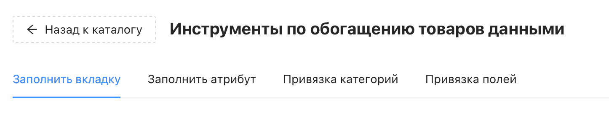
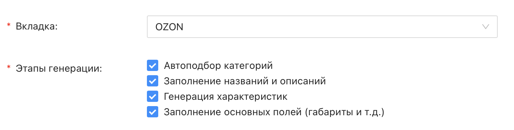
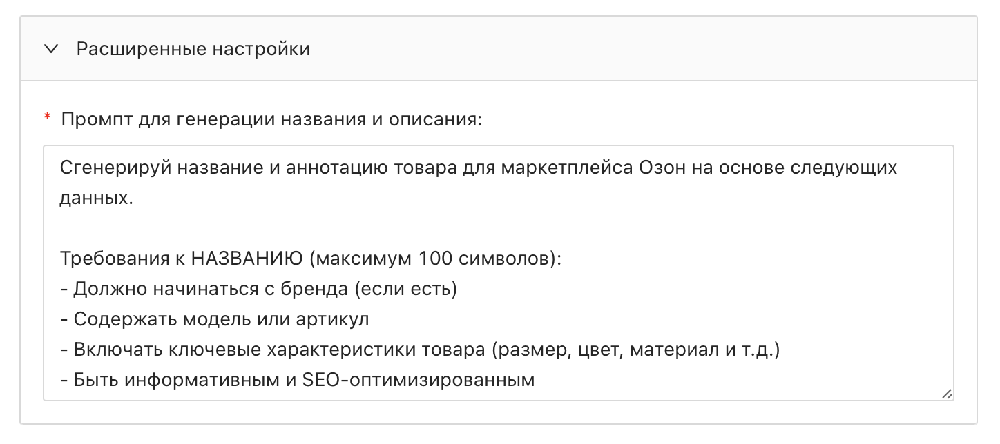
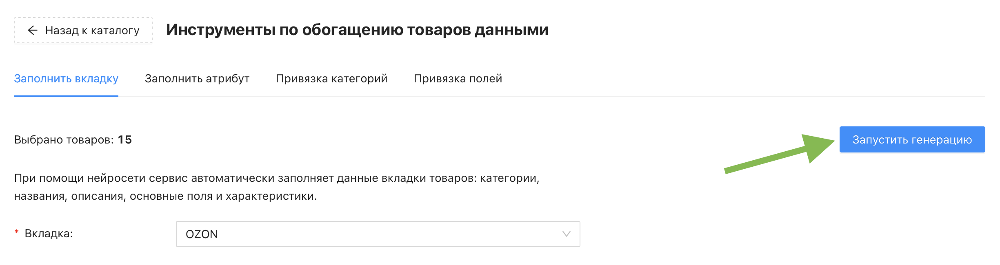
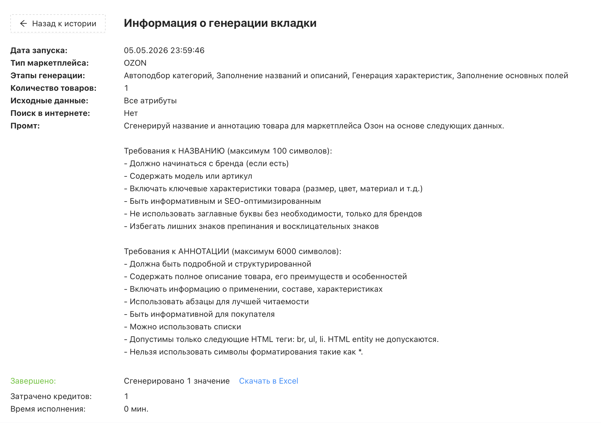

# Инструмент "Заполнить вкладку"

Инструмент "Заполнить вкладку" автоматически заполняет данные выбранной вкладки товара с помощью нейросети: категорию, название, описание, основные поля и характеристики. Это основной способ быстрой подготовки карточек к дальнейшей выгрузке.

❇️ Инструмент расходует кредиты проекта. Генерация данных для одного товара затрачивает один кредит (независимо от количества выбранных этапов генерации и других настроек). При неудачной генерации для товара кредит не будет списан 
 

## Где найти инструмент?

Перейдите в раздел "Каталог товаров" → кнопка "Инструменты" → раздел "Заполнить вкладку"

## Настройки инструмента

### Обязательные настройки

Обязательные настройки помечены красной зведочкой, их заполнение является обязательным.

У инструрмента "Заполнить вкладку" их две:
* _Вкладка_ – выберите вкладку каталога (маркетплейс), для которой нужно заполнить данные, например OZON. Именно под требования и ограничения этой площадки нейросеть будет гененрировать данные
* _Этапы генерации_ – выберите, какие именно данные о товаре должна заполнить нейросеть. По-умолчанию все четыре этапа включены в будущюю генерацию, можно запустить все сразу или оставить только нужные:
  * _Автоподбор категорий_ – нейросеть подберёт подходящую категорию маркетплейса для каждого товара на основе его основного названия
  * _Заполнение названий и описаний_ – нейросеть сформирует названия и описания товаров под требования выбранного маркетплейса
  * _Генерация характеристик_ – нейросеть заполнит характеристики товара, доступные в категории маркетплейса
  * _Заполнение основных полей_ – нейросеть заполнит габариты, вес и другие основные поля вкладки (которые чаще всего являются обязательными полями для заполнения)
 

### Остальные настройки

* _Исходные данные_ – отвечает за выбор какие атрибуты каталога нейросеть будет использовать как источник. По умолчанию передаются все атрибуты товара. Если нужно ограничить контекст – переключитесь на настройку "Выбрать атрибуты" и выберите конкретные атрибуты вручную через кнопку "+ Добавить"
* _Поиск недостающей информации в интернете_ – если включено, нейросеть будет дополнительно искать данные о товаре в сети. Полезно, если в каталоге мало исходных данных. По умолчанию выключено
* _Генерировать только для незаполненных полей_ – нейросеть пропустит поля, в которых у товара уже есть данные. Отключите, если хотите перегенерировать всё с нуля. По умолчанию включено
 

### Расширенные настройки

❕ Данный раздел появляется лишь после выбора маркетплейса в обязательном поле "Вкладка"

* _Промпт для генерации названия и описания_ – позволяет задать собственную инструкцию для нейросети вместо стандартного промпта Databird. Используйте, если вам нужен особый стиль, структура или требования к тексту, отличные от стандартных. Обратите внимание, что поле содержит сразу два промта: для названия и для описания. Обязательное поле
 

## Запуск генерации

Когда все настройки заданы, нажмите синюю кнопку «Запустить генерацию» в правом верхнем углу. Появится предупреждение о списании кредитов проекта и перезаписи атрибутов вкладки для выбранных товаров – подтвердите его.

После подтверждения откроется страница раздела «Генерация контента», где можно отслеживать статус текущей генерации в режиме реального времени. По окончании там же будет доступна итоговая информация:

* затраченное время
* количество списанных кредитов
* файл Excel с результатами генерации

⚠️ Результаты генерации рекомендуется проверить перед экспортом — нейросеть может ошибиться в категории или характеристиках, если исходные данные товара неполные или данные о товаре в интернете не соответвуют действительности
