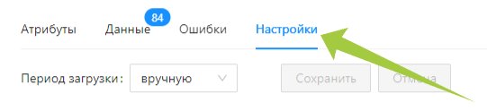

---
layout: default
title: Как обновить остатки товаров в каталоге Databird
---

# Как обновить остатки товаров в каталоге Databird

В какой-то момент может потребоваться обновить остатки товаров уже имеющихся в каталоге Databird. В зависимости от типа источника данных об остатках, это можно сделать двумя способами: **из уже имеющегося подключения** или **создав новое подключение** исключительно для остатков.

### Обновление остатков из уже имеющегося подключения

Переходим в во вкладку “Настройки” уже имеющегося подключения.

При необходимости устанавливаем таймер, чтоб остатки обновлялись автоматически с некой периодичностью.

Внизу страницы, в настройках обновления каталога, выбираем: 

- “Создание новых товаров” ⇒ “Не создавать”
- “Добавление исходных полей”  ⇒ “Не добавлять”

В список атрибутов для обновления добавляем атрибут отвечающий за остатки товара.

Сохраняем изменения и запускаем подключение, чтоб обновить остатки.

### Обновление остатков путем создания нового подключения

Этот вариант может подойти, если остатки товаров у вас хранятся в отдельном файле.

Для начала создаем новое подключение, хорошо, если в названии будет фигурировать слово “Остатки”, чтоб когда-нибудь не запутаться. Во вкладке “Атрибуты” заполняем лишь два атрибута: “ID товара” и “Остаток”. 

❗Правило атрибута ”ID товара” **должно совпадать** с аналогичным правилом атрибута в оригинальном подключении, так как связь в каталоге будет устанавливаться с его помощью.

Далее действуйте по шагам “Обновление остатков из уже имеющегося подключения” (описаны в этой статье выше).
