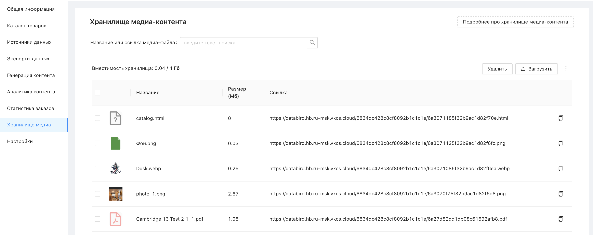
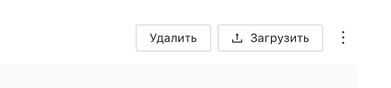
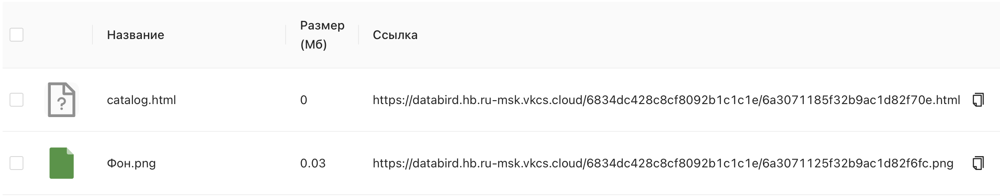
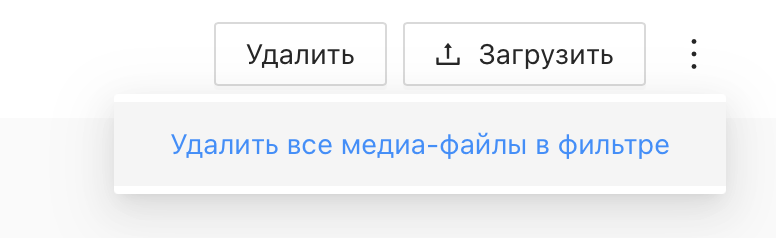

# Что такое хранилище медиа-контента?

Хранилище медиа-контента – это встроенный облачный файловый менеджер в Databird, где можно хранить медиафайлы (изображения, PDF и другие документы) и получать прямые ссылки на них. Эти ссылки можно использовать в атрибутах товаров – например, для передачи фотографий или документов при выгрузке на маркетплейсы.

Сюда же автоматически сохраняются изображения, сгенерированные инструментом [«Генерация инфографики»](/instrument-infografica/).

 

## Где найти хранилище?

Перейдите в раздел **"Хранилище медиа"** в левом меню.

 

## Объём хранилища

Доступный объём зависит от тарифа проекта:

* **Тестовый тариф (7 дней)** – 20 МБ
* **Полноценный тариф** – 1 ГБ (= 1000 МБ), с возможностью приобрести дополнительное место

Текущий объём занятого и доступного места отображается над таблицей файлов в формате **"занято / доступно"**.

❕ Если у вас есть основной проект и дочерние проекты – хранилище у них общее, и его объём делится между всеми проектами.

⚠️ Если хранилище переполнено, загрузка новых файлов станет недоступна, а инструменты, которые сохраняют файлы в хранилище (например, «Генерация инфографики»), перестанут работать. Чтобы продолжить работу, освободите место, удалив ненужные файлы, или приобретите дополнительный объём на странице [databird.ru/prices](https://www.databird.ru/prices).

Актуальные цены на дополнительное хранилище доступны на странице [databird.ru/prices](https://www.databird.ru/prices).

 

## Загрузка файлов

Нажмите кнопку **"Загрузить"** в правом верхнем углу и выберите нужный файл на вашем устройстве. После успешной загрузки в хранилище - файл появится в таблице.

❕ Вы можете выбрать один или несколько файлов сразу — сервис загрузит их последовательно. Если при загрузке одного из файлов произойдёт ошибка, процесс остановится, а вы получите соответствующее уведомление.

❕ Загруженные файлы получают те имена, которые были у них в момент загрузки на устройстве. Возможность переименования файлов в хранилище на данный момент не предусмотрена – если нужно изменить имя, переименуйте файл на устройстве перед загрузкой

❕ Если загружаемый файл имеет то же название, что и уже существующий в хранилище, он будет сохранён с числовой припиской: _1, _2 и так далее

❕ Файлы, которые сохраняются в хранилище автоматически — при загрузке фото в карточке товара каталога или в результате генерации — получают имя по следующему стандарту:
{ID товара}-{название вкладки}(если есть)-{название файла}-{порядковый номер при повторе}.{расширение}

 

## Работа с файлами

Для каждого загруженного файла в таблице отображается:

* **Название** – имя файла
* **Размер (МБ)** – объём, который файл занимает в хранилище (в мегабайтах)
* **Ссылка** – прямая ссылка на файл. Нажмите на кнопку справа, чтобы быстро скопировать её в буфер обмена

Скопированную ссылку можно вставить в нужный атрибут товара в каталоге.

Если файл является изображением (PNG, JPG и другие форматы фото), при нажатии на его иконку слева откроется **предпросмотр на весь экран**.

 

## Поиск файлов

Используйте строку поиска вверху страницы для поиска файла по его названию или ссылке.

 

## Сохранение в Excel

Нажмите кнопку "Сохранить в Excel", чтобы выгрузить список файлов хранилища в Excel-файл.

Если задан поиск или отмечены файлы чекбоксами — выгрузятся только они. Если фильтр не задан — выгрузится информация обо всех файлах хранилища (но не более 10.0000 строк)

 

## Удаление файлов

Выберите один или несколько файлов с помощью чекбоксов слева и нажмите кнопку **"Удалить"**.

Также доступна опция **"Удалить все медиа-файлы в фильтре"** – она открывается по кнопке с тремя точками (⋮) рядом с кнопкой "Загрузить". Эта опция удаляет все файлы, попадающие под текущий поисковый фильтр.

⚠️ Удаление файлов из хранилища необратимо. Если ссылка на удалённый файл используется в атрибутах товаров, она перестанет работать.

## Связанные операции JSONata

**getMedia($VALUE)** – возвращает массив ссылок на файлы из хранилища медиа-контента, имена которых начинаются с переданной в параметре подстроки. Функция реализована только в виде JSONata-выражения.
