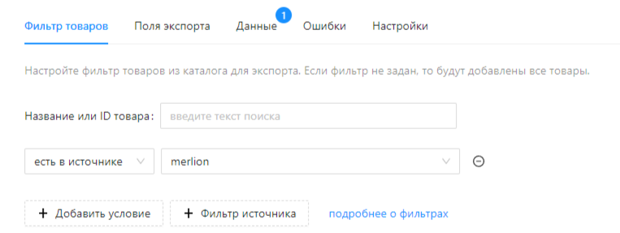

---
layout: default
title: 
---

# Настройка фильтров

## Зачем нужны фильтры в экспорте?

Фильтры позволяют указать, какие товары каталога должны быть показаны в каталоге или выгружаться в экспорте. Вы можете добавить несколько фильтров. В экспорт буду добавляться только товары, удовлетворяющие сразу всем фильтрам. Ниже, в строке “Выбрано товаров” указано общее количество товаров подпадающих под заданные фильтры.

## Как настроить фильтры?

### Условные фильтры

Нажмите кнопку “+ Добавить фильтр” для добавления фильтра. 

Сервис поддерживает следующие условия, которые можно применять к любому атрибуту:

| **Арифметические
 >, <, ≥, ≤, =, ≠** | Можно применять к атрибутам с числовыми значениями или к датам (кроме ≠). |
| --- | --- |
| содержит, не содержит | Фильтр проверяет вхождение заданной подстроки в значение атрибута. Регистр текста не учитывается. |
| в списке, не в списке | Фильтр проверяет значение атрибута на равенство с одним из значений в заданном списке. Значения в списке нужно перечислить через запятую (,). Регистр текста и боковые пробелы не учитываются. |
| задан, не задан | Фильтр срабатывает, если у товара задано/не задано значение атрибута.  |

Не забудьте сохранить фильтр, чтобы изменения вступили в силу.

### Фильтры по источнику

Нажмите кнопку “+ Фильтр источника” для добавления фильтра. 

Сервис поддерживает следующие условия, которые можно применять к любому созданному источнику:

| есть в источнике | Отбирает товары, “ID товара” которых сейчас представлен в указанном источнике |
| --- | --- |
| нет в источнике | Отбирает товары, “ID товара” которых сейчас не представлен в указанном источнике |

Не забудьте сохранить фильтр, чтобы изменения вступили в силу.

## Специальное условие для загрузки товара в источниках или экспортах

Для настройки сложной логики с условиями и микропрограммами вы можете воспользоваться полем “**Условие для загрузки товара**” в Настройках источника или экспорта. Данное условие будет применяться для каждой записи непосредственно перед включением товара в экспорт. Подробнее про настройку смотрите в  . Если значение выражения true, то товар будет обработан, иначе отброшен в процесс загрузки или экспорта.

