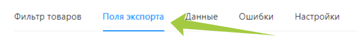

---
layout: default
title: Настройка правил экспорта
---

# Настройка правил экспорта

⚠️ При экспорте в JSON файл настройка правил не требуется, товары в готовом файле будут описаны так, как были занесены в каталог товаров Databird при подключении.

Настройка правил выгрузки во внешние системы происходит внутри каждого экспорта во вкладке **“Поля экспорта”**.

Правила задаются по тому же принципу, что и при подключении, используя колонку *“Исходные поля”* ****или средства языка JSONata.

❕Красной звездочкой помечены поля обязательные для заполнения, остальные при ненадобности могут быть пропущены.

Помимо вкладки “Основные” надо будет заполнить вкладку “Характеристики”.

В момент создания экспорта система автоматически подставляет некоторые привязки, если они вам не нужны, то для вкладки “Характеристики” предусмотрена кнопка “Отчистить поля”.

