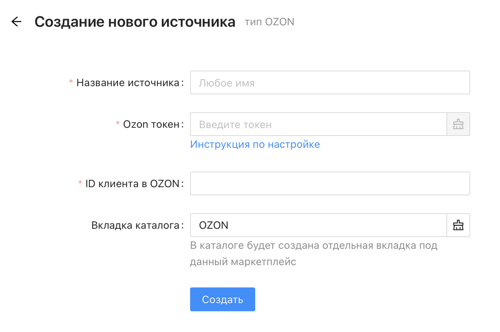
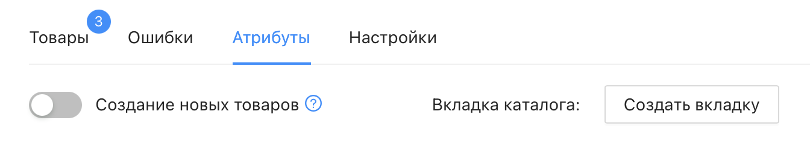
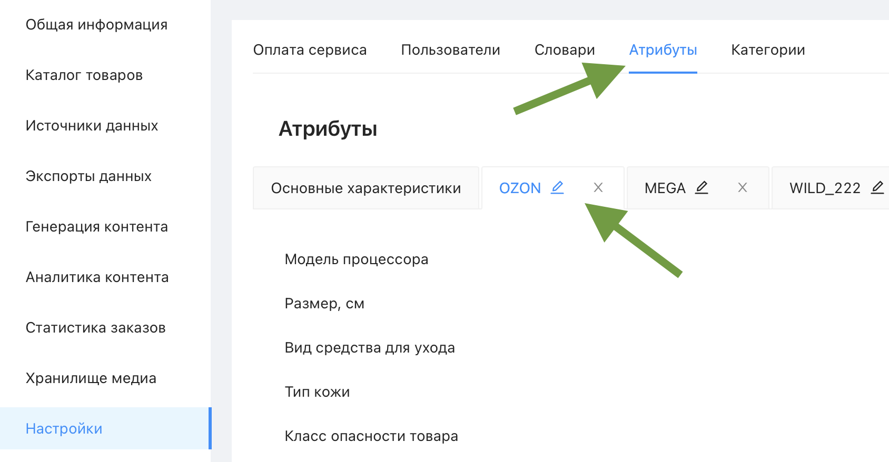

# Настройка вкладки источника

Управлять [вкладками](https://docs.databird.ru/chto-takoe-vkladka/) каталога – создавать, переименовывать и удалять – можно в разделе "Настройки" → "Атрибуты". Привязка вкладки к источнику и соответствие её атрибутов настраиваются внутри самого источника.

 

## Создание вкладки при создании источника

При создании нового источника для маркетплейса (OZON, Wildberries, Яндекс Маркет и т.д.) в форме подключения есть необязательное поле **"Вкладка каталога"**. Если указать в нём название – в каталоге будет автоматически создана отдельная вкладка под этот маркетплейс и сразу привязана к источнику.

Поле можно оставить пустым – тогда источник будет создан без привязанной вкладки, и её можно будет создать и привязать позже.

 

## Создание и привязка вкладки внутри уже созданного источника

Если при создании источника вкладка не была указана, её можно создать позже – откройте источник и перейдите на вкладку **"Атрибуты"**. Там будет доступна кнопка **"Создать вкладку"**.

 

## Удаление и переименование вкладок

Удалить или переименовать существующую вкладку можно в разделе "Настройки" → "Атрибуты" – рядом с названием каждой вкладки есть значки редактирования и удаления.

⚠️ Удаление источника, к которому привязана вкладка, также приводит к удалению этой вкладки во всех товарах каталога.
