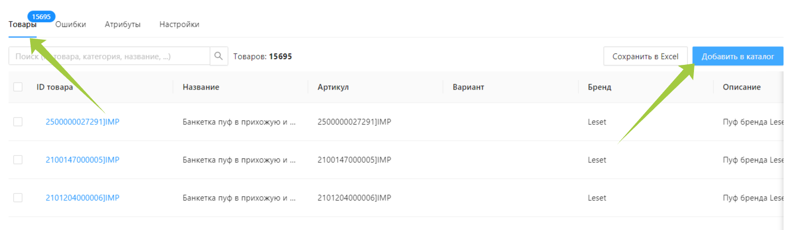

---
layout: default
title: Перенос карточки товара из OZON в Wildberries
---

# Перенос карточки товара из OZON в Wildberries

Для переноса данных карточки из одного маркетплейса в другой создадим новое подключение (импорт). Для этого в левой части страницы прейдем во вкладку “Источники данных”.

❕ Если ранее вы уже создавали подключения, то сначала потребуется нажать на кнопку “Добавить подключение” в правом верхнем углу страницы.

В данном примере мы будем рассматривать перенос карточки товара из маркетплейса OZON на маркетплейс Wildberries, поэтому среди предложенных вариантов находим “Получение товаров из маркетплейса Озон” и нажимаем на кнопку *“*Выбрать*”*.

В открывшемся окне заполняем необходимые поля и жмем кнопку “Создать”. 

❕Название не должно содержать пробелов. Может состоять из букв, цифр, и знака  `_`

🔗  Подробнее о создании подключений:

[Источники данных](%D0%98%D1%81%D1%82%D0%BE%D1%87%D0%BD%D0%B8%D0%BA%D0%B8%20%D0%B4%D0%B0%D0%BD%D0%BD%D1%8B%D1%85%204f2e7387f2df4430ae3aa03533b23d4c.md)

Теперь произведем пробную загрузку, чтобы убедиться, что данные введены верно и все работает. Для этого стоит нажать по кнопке “Выполнить” в правом верхнем углу. После окончания загрузки, статус загрузки изменится на “ок”.

🔗  Подробнее о проверке подключений:

[Проверка загрузки](%D0%9F%D1%80%D0%BE%D0%B2%D0%B5%D1%80%D0%BA%D0%B0%20%D0%B7%D0%B0%D0%B3%D1%80%D1%83%D0%B7%D0%BA%D0%B8%203d910655b86d4b14a52afc4bee8c0c3c.md)

Перейдя во вкладку “Правила”, можно заметить, что Databird уже сам прописал некоторые из них, присвоив атрибуту системы соответствующее поле источника. Тут вы можете внести свои коррективы.

🔗  Подробнее о настройке правил:

[Настройка правил загрузки](%D0%9D%D0%B0%D1%81%D1%82%D1%80%D0%BE%D0%B9%D0%BA%D0%B0%20%D0%BF%D1%80%D0%B0%D0%B2%D0%B8%D0%BB%20%D0%B7%D0%B0%D0%B3%D1%80%D1%83%D0%B7%D0%BA%D0%B8%20b0b2d97cad3a4036896cecad534e9201.md)

Во вкладке “Данные” отобразятся товары и их атрибуты, полученные в данном подключении. 

Чтобы увидеть все атрибуты конкретного товара, можно нажать по его ID. В открывшемся окне, во вкладке “Атрибуты”, будет их полный перечень.

Во вкладке “Исходные поля” этого же окна, можно посмотреть в каком виде пришли данные на конкретный товар.

После всех правок запускаем итоговую загрузку, щелчком по кнопке “Выполнить”. После чего нажимаем по кнопке “Добавить в каталог”, чтобы все товары из источника попали в каталог Databird.

Импортом данных закончен, теперь займемся экспортом. Для этого перейдем во вкладку “Экспорт данных”.

❕ Если ранее вы уже создавали экспорты, то сначала потребуется нажать на кнопку “Добавить экспорт” в правом верхнем углу страницы.

Мы рассматриваем перенос карточки товара на маркетплейс Wildberries, поэтому среди предложенных вариантов экспорта находим “WILD_CARDS” и нажимаем на кнопку *“*Выбрать*”*.

В открывшемся окне “Создание нового экспорта” нужно дать ему осмысленное название, ввести токен и нажать кнопку “Создать”. 

❕Название не должно содержать пробелов. Может состоять из букв, цифр, и знака  `_`

🔗  Подробнее о создании экспортов:

[Экспорты данных](%D0%AD%D0%BA%D1%81%D0%BF%D0%BE%D1%80%D1%82%D1%8B%20%D0%B4%D0%B0%D0%BD%D0%BD%D1%8B%D1%85%20cf1ee31a29e74823b01b4bf20d97ce18.md)

При необходимости выборочного экспорта товаров добавляем фильтр.

🔗  Подробнее о фильтрах:

[Как произвести выборочный экспорт товаров](%D0%9A%D0%B0%D0%BA%20%D0%BF%D1%80%D0%BE%D0%B8%D0%B7%D0%B2%D0%B5%D1%81%D1%82%D0%B8%20%D0%B2%D1%8B%D0%B1%D0%BE%D1%80%D0%BE%D1%87%D0%BD%D1%8B%D0%B9%20%D1%8D%D0%BA%D1%81%D0%BF%D0%BE%D1%80%D1%82%20%D1%82%D0%BE%D0%B2%D0%B0%D1%80%D0%BE%D0%B2%20230737781a784b22b3199f40f509a63d.md)

[Настройка фильтров](%D0%9D%D0%B0%D1%81%D1%82%D1%80%D0%BE%D0%B9%D0%BA%D0%B0%20%D1%84%D0%B8%D0%BB%D1%8C%D1%82%D1%80%D0%BE%D0%B2%2067018db9aca848158452fe98eb821a4f.md)

Теперь необходимо связать категории товара на Databird с категориями товара на маркетплейсе. Для этого переходим во вкладку “Категории” и нажимаем кнопку “Добавить”.

🔗  Подробнее о связывании категорий:

[Связывание категорий](%D0%A1%D0%B2%D1%8F%D0%B7%D1%8B%D0%B2%D0%B0%D0%BD%D0%B8%D0%B5%20%D0%BA%D0%B0%D1%82%D0%B5%D0%B3%D0%BE%D1%80%D0%B8%D0%B9%202d6664c987e34fef8e1a66fdeda48d36.md)

В выпадающем списке находим максимально близкую категорию товара на маркетплейсе, можно воспользоваться поиском, начав вводить ключевые слова.

Когда оба поля будут заполнены, сохраняем результат. Таким образом нужно связать все категории.

Во вкладке “Поля экспорта” часть правил подвкладки “Основные” уже будет заполнена, но вы всегда можете изменить их, используя правила или средства языка JSONata.  Помеченные красной звездочкой, обязательны к заполнению.

Рядом с подвкладкой “Основные” находится подвкладка “Характеристики”, которая заполнится полями после связывания категорий. Эти поля требуют отдельного заполнения.

Когда все нужные поля будут заполнены, нажмите на кнопку “Проверка” в верхнем правом углу страницы и дождитесь окончания загрузки.

🔗  Подробнее о проверке экспорта:

[Проверка экспорта](%D0%9F%D1%80%D0%BE%D0%B2%D0%B5%D1%80%D0%BA%D0%B0%20%D1%8D%D0%BA%D1%81%D0%BF%D0%BE%D1%80%D1%82%D0%B0%20f6ed5bb4a72143dead100cde18c96a63.md)

Если статус загрузки сменился на “тест”, значит экспорт исправно функционирует.

