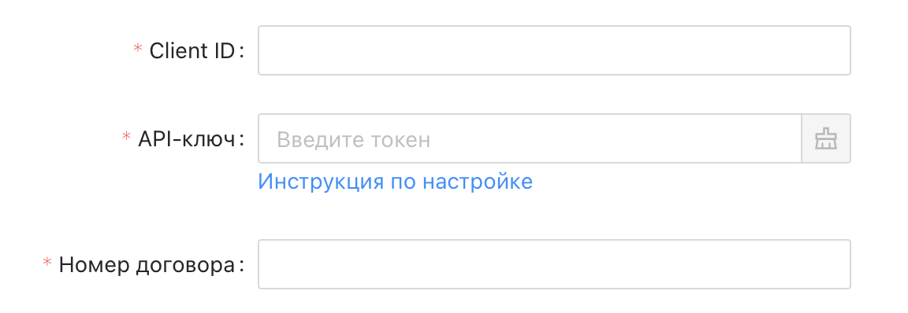
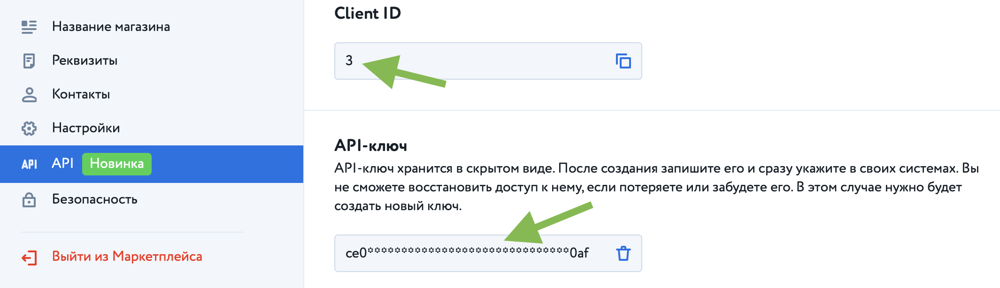
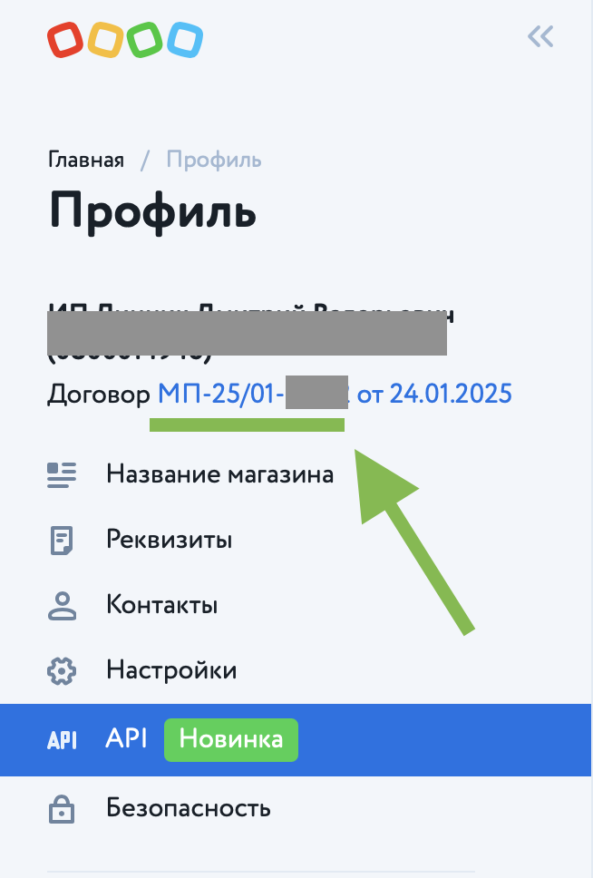

# Подключение к Детский мир

Для подключения маркетплейса Детский мир к сервису Databird нужно заполнить 3 обязательных поля: Client ID, API-ключ и Номер договора.

Все эти данные можно найти в разделе "Профиль" => "API" кабинета партнера ДМ или по ссылке: https://detmir.market/profile/api

Скопируйте значения Client ID и API-ключ со страницы и вставьте в соответсвующие поля при создании нового источника

Номер договра указан в меню слева, под именем вашего профиля. Вам потребудется только номер, без даты

❕ Иcходя из вашего договра DataBird поймет по какой схеме вы работаете с маркетплейсом: FBO или FBS
* Если вы работатее через схему FBO - при экспорте товара поле "Закупочная цена" будет обязательным к заполнению
* Если вы работатее через схему FBS - при экспорте товара поле "Залоговая стоимость" будет обязательным к заполнению
