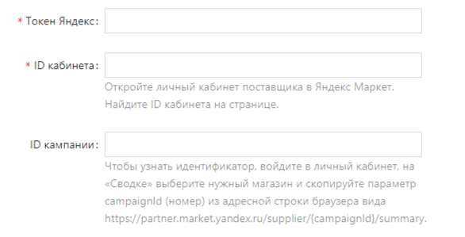

---
layout: default
title: 
---

# 

Для подключения маркетплейса  нужно заполнить следующие поля:

1. Если ранее вы уже получали токен Яндекс Маркета, то введите его в поле “**Токен Яндекс**”. Если же нет, то нажмите кнопку “Получить токен” и следуйте дальнейшим инструкциям Яндекса по авторизации.

1. Чтобы получить “**Идентификатор кампании**” - откройте личный кабинет поставщика в Яндекс Маркет. Найдите поле “ID кабинета” на странице и скопируйте его значение в поле “Идентификатор кампании”.
    
    
    
2. Чтобы получить “**Номер кампании**” - Перейдите в раздел "Сводка", где в выпадающем списке справа (не сверху!) выберите нужный вам магазин. Далее кликните по строке с адресом страницы (URL ссылку) и скопируйте из нее Номер кампании (лишь набор цифр). Вставьте ранее скопированное значение в поле "Номер кампании"

      🌐 Пример: https://partner.market.yandex.ru/supplier/**1234567**/summary

