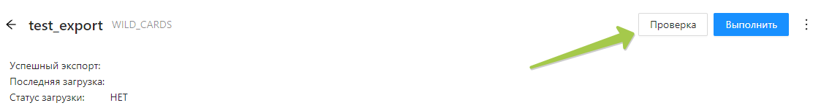

---
layout: default
title: 
---

# 

После того, как все нужные поля во вкладке **“Правила”** были заполнены, требуется провести проверку экспорта, чтоб отследить и исправить возникшие ошибки. 

Для этого надо нажать на кнопку “Проверить” в правом верхнем углу страницы, тогда будет произведена подготовка выгрузки, автоматически проверятся все поля, но самого экспорта не случится.

Ошибки могут возникнуть и отобразиться как в статусе загрузки, так и во вкладке **“Ошибки”.**

❗Статус загрузки сообщит вам что именно пошло не так, это поможет исправить возникшую ошибку. Исправление ошибок происходит по аналогии с тем, как это было при проверке загрузки.

После того как все ошибки будут устранены, еще раз нажмите кнопку *“Проверка”* и подождите окончания загрузки. Если интересующие вас ошибки пропали, во вкладке **“Данные”** появилось нужное число позиций, а статус загрузки сменился на “тест”, то  прошла успешно.

