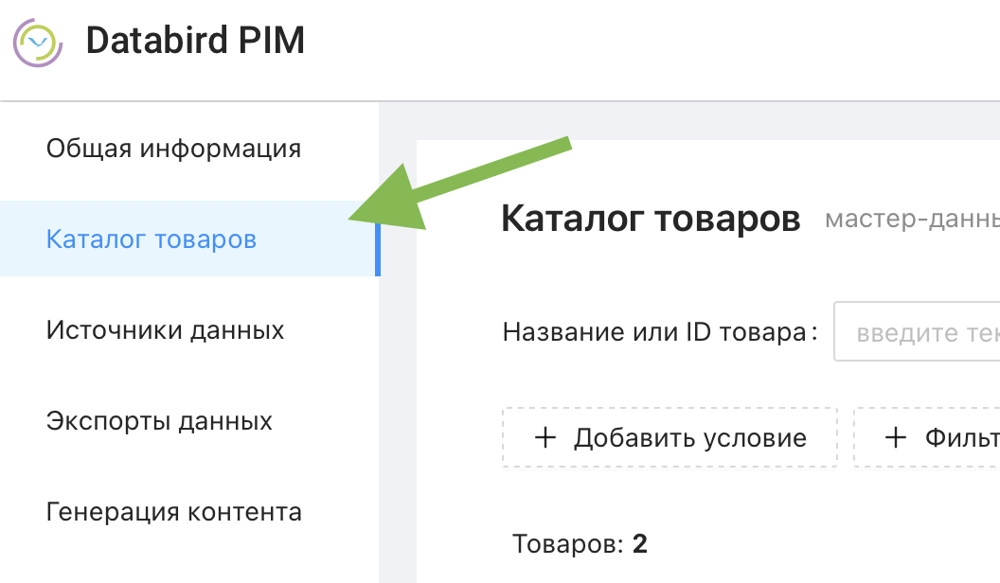
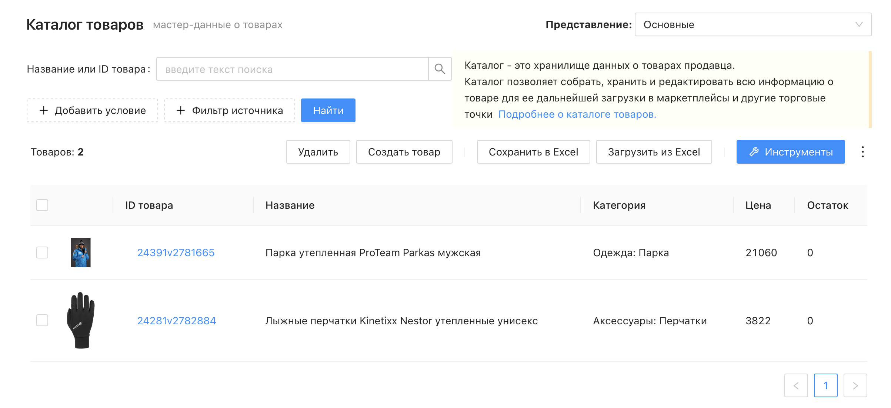
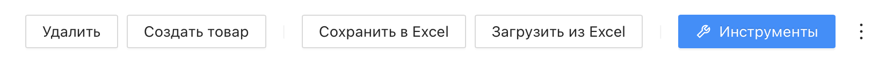
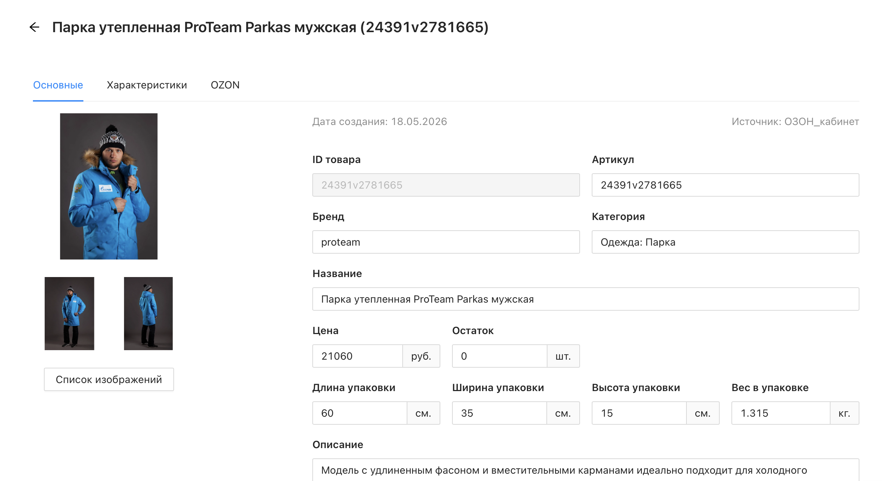
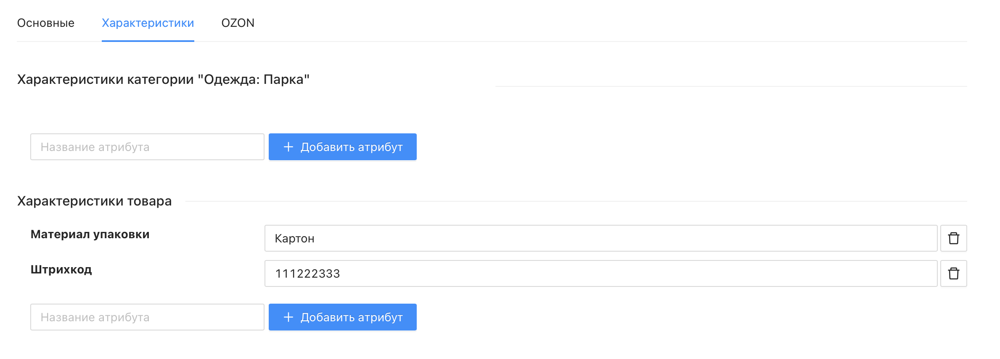
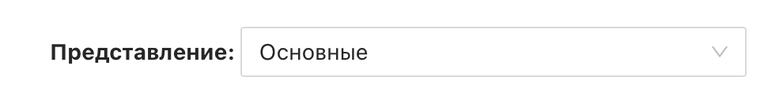

# Каталог товаров

Каталог товаров — это хранилище мастер-данных о товарах в Databird. Здесь собирается, хранится и редактируется вся информация о товаре: основные атрибуты, характеристики, изображения и данные для каждого маркетплейса. Именно из каталога товары выгружаются на торговые площадки.

Чем более полная информация о товаре представлена в каталоге, тем больше параметров можно заполнить при экспорте.

 

## Где найти каталог?

Перейдите в раздел **"Каталог товаров"** в левом меню.

На странице отображается список всех товаров проекта с колонками: **ID товара**, **Название**, **Категория**, **Цена** и **Остаток**. В верхней части доступны поиск по названию или ID и фильтры.

 

### Действия со списком товаров

Над списком расположены кнопки для работы с товарами:

* _**Удалить**_ – удалить выбранные товары
* _**Создать товар**_ – создать новый товар вручную
* _**Сохранить в Excel**_ – выгрузить текущий список товаров в файл Excel
* _**Загрузить из Excel**_ – импортировать товары из файла Excel
* _**Инструменты**_ – запустить инструменты массовой обработки товаров, например "Заполнить вкладку"
* _**⋮**_ - меню с дополнительными инстурментами каталога, работающими по фильрам
  * Создать экспорт по фильтрам - создает экспорт, сохраняя фильтры установленные в каталоге
  * Удалить все товары в фильтре - удаляет из каталога все товара попадающие под установленные в каталоге фильтры

 

## Карточка товара

Нажмите на ID товара в списке, чтобы открыть его карточку. Карточка содержит несколько вкладок.

 

### Вкладка "Основные"

Содержит фиксированный набор системных атрибутов товара:

* _**ID товара**_ – уникальный идентификатор товара в Databird, присваивается автоматически и не редактируется
* _**Артикул**_ – артикул товара
* _**Бренд**_ – бренд товара
* _**Категория**_ – категория товара в каталоге
* _**Название**_ – основное название товара
* _**Цена**_ и _**Остаток**_ – цена и текущий остаток
* _**Габариты и вес упаковки**_ – длина, ширина, высота и вес
* _**Описание**_ – текстовое описание товара
* _**Изображения**_ – фотографии товара; кнопка "Список изображений" открывает полный список с возможностью управления

 

### Вкладка "Характеристики"

Содержит расширенные атрибуты товара, разделённые на две группы:

* _**Характеристики категории**_ – атрибуты, привязанные к категории товара. Здесь можно добавить новый атрибут категории через кнопку "+ Добавить атрибут"
* _**Характеристики товара**_ – пользовательские атрибуты конкретного товара. Сюда же попадают исходные поля из источника данных, если в настройках источника включена соответствующая опция

 

### Вкладки маркетплейсов

Помимо основных вкладок, в карточке товара отображаются вкладки для каждого подключённого маркетплейса (например, **OZON**, **DM**). В них хранятся данные товара, адаптированные под требования конкретной площадки. Подробнее о работе с вкладками маркетплейсов — в отдельной статье.

