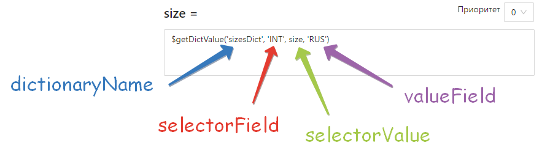
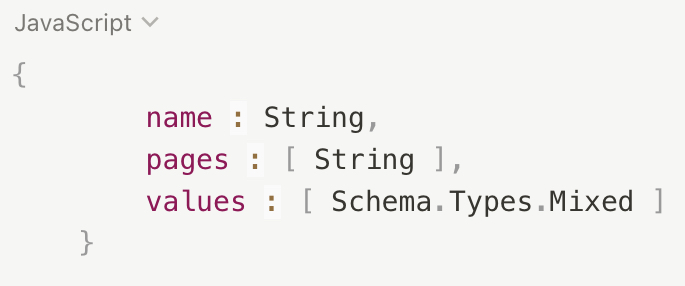
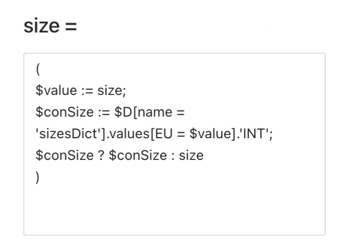

---
layout: default
title: 
---

# 

🔗 ****В данном разделе будут использоваться уже готовые словари, для полного понимания, рекомендуем сначала ознакомиться со следующими связанными разделами: 

[?](/chto-takoe-slovari/)

Для работы со словарями Databird используются две функци:

1. **$getDictValue(dictionaryName, selectorField, selectorValue, valueField)** - возвращает значение valueField словаря dictionaryName, в котором поле selectorField равно значению selectorValue. Используется для размерных таблиц и иных преобразований.

1. **$getDictionary(dictionaryName) -** возвращает массив values словаря по имени dictionaryName.

## Использование словарей **при написании правил Databird**

При написании правил, иногда возникают ситуации, когда вам требуются перевести данные из одного формата в другой, чтобы затем приравнять их к атрибуту товара Databird. С этим могут помочь созданные вами ранее словари. 

**Примеры:**

Требуется перевести значения size (размер) из формата RUS в INT используя данные словаря sizesDict.

      📝 Системному атрибуту size (размер) присваиваем значение функции **$getDictValue()**, куда по порядку передаем: название словаря, название столбца формата в котором сейчас представлены данные, соответствующее исходное поле, название столбца откуда будут браться новые данные. 

      📝 Тоже самое можно реализовать, используя функцию **$getDictionary()**, однако код будет сложнее и массивнее.

