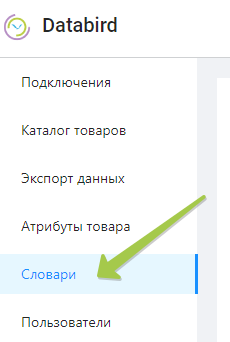

---
layout: default
title: Создание и редактирование словарей
---

# Создание и редактирование словарей

Для создания нового словаря следует в левом окне сайта перейти во вкладку **“Словари”**.

На отрывшейся странице будут отображаться уже созданные ранее словари. За создание нового отвечает кнопка *“Добавить словарь”* в правом верхнем углу страницы. 

В открывшемся окне нужно дать словарю имя, после чего нажать на кнопку *“Сохранить”*.

После проделанных действий во вкладке **“Словари”** будет создан новый пустой шаблон, щелчком кнопки мыши по его названию, перейдем к его редактированию.

Так как каждый словарь представляет собой таблицу данных, то создать его наполнение можно в редакторе таблиц Excel.

❕Наполнение словаря создается по определенным правилам. Первая строка должна содержать в себе названия колонок. Колонки, где отсутствует первая строка, при создании словаря будут проигнорированы. Остальные ячейки в колонке не обязательны к заполнению.

Когда табличный файл с наполнением для словаря будет готов, можно загрузить его в созданный шалон, нажав на кнопку “Загрузить словарь”.

Подождите немного и вы увидите, что шаблон стал словарем.

❕Если при создании наполнения словаря вы допустили ошибку или вам требуется расширить его, просто загрузите исправленный табличный файл, воспользовавшись кнопкой *“Загрузить словарь”*.

✔️ Созданный таким образом словарь вы можете использовать при написании правил, чтобы удобно переводить данные из одного формата в другой.

