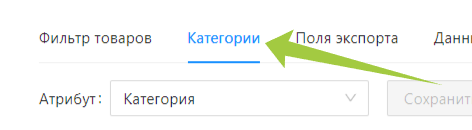

---
layout: default
title: 
---

# 

⚠️ Данная настройка требуется только при экспорте товаров из каталога Databird на маркетплейс (OZON, Wildberries, Яндекс Маркет и другие).

При экспорте на маркетплейсы нужно указать категорию товара Databird и категорию товара на маркетплейсе, без этого экспорт не сможет быть произведен. Связывание происходит во вкладке *“Категории”*.

Для начала необходимо выбрать атрибут привязки, на основе значений этой категории вашего каталога будет происходить привязка с категориями экспорта (категории маркетплейса)

Для товаров идущих на экспорт, согласно установленных фильтрам, DataBird сама предложит привязать категорию экспорта на основе выбранного ранее атрибута.

### Автоподбор

Для упрощения процесса привязки категорий в экспорте присутствует кнопка автоподбора.

После щелчка курсором по которой, встроенная нейросеть подберет самую подходящую категорию экспорта. Вам останется лишь сверить, что категория действительно подходит, и подтвердить привязку кнопкой “Ок”.

❗Автоподбор не гарантирует правильность подобранной категории, он лишь предлагает пользователю возможный вариант, чтобы облегчить процесс поиска нужной категории экспорта.

### Ручная привязка

После щелчка мыши по кнопке редактирования появится выпадающий список, из которого нужно выбрать подходящую категорию экспорта. Вы можете начать вводить ключевые слова, чтобы сузить разброс вариантов.

❕Самый первый вариант в выпадающем списке (прописан курсивом) предложен автоподбором.

