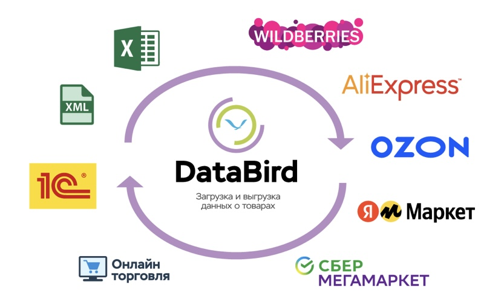

# Возможности и преимущества системы

**Databird** — это сервис для универсальной интеграции между маркетплейсами, складскими системами и вашими сайтами.

## П**реимущества Databird:**

⏰ Экономит до **80%** времени работы в кабинете маркетплейсов

📈 В **2 раза** увеличивает скорость реакции на события в продажах

📉 Снижает затраты на интеграцию с маркетплейсом и сайтом **в 10 раз**

## **Основные возможности Databird**

🎯 **Поддержка множества маркетплейсов и площадок**
- Полноценная интеграция и работа в едином окне со всеми ключевыми игроками рынка: **Wildberries, Ozon, Яндекс Маркет, Мегамаркет, Детский мир и Авито**.

🎯 **Умное создание и ИИ-генерация карточек товаров**
- Автоматическое создание карточек на целевых маркетплейсах.
- **Генерация и обогащение контента с помощью ИИ (Аишкой):** создание карточек с нуля, имея на руках только базовое название и описание.
- **Автоматический поиск информации:** система самостоятельно найдет недостающие характеристики и данные о товаре в интернете и заполнит карточку за вас.

🎯 **Глубокая аналитика маркетплейсов**
- Мощный модуль сквозной аналитики для **Wildberries, Ozon и Яндекс Маркета**.
- Отслеживание ключевых метрик, динамики продаж, рентабельности и эффективности магазинов в одном интерфейсе.

🎯 **Перенос карточек из одного маркетплейса в другой**
- Быстрый кросс-платформенный перенос карточек с автоматическим дополнением недостающей информации.
- Разовая настройка правил переноса и связки категорий каталогов.

🎯 **Корректировка контента карточек**
- Настройка любой логики дополнения контента.
- Удаление лишнего контента.
- Модификация значений полей, устранение ошибок.

🎯 **Загрузка данных от поставщиков**
- Сбор данных в любых форматах (xls, csv, xml, json, 1c, Б24, Google таблицы, Мойсклад, api и других).
- Автоматическое обновление данных с необходимой частотой.

🎯 **Разбор данных на отдельные атрибуты**
- Даже если все данные пришли одной сплошной строчкой, сервис разберёт их на отдельные атрибуты.
- Если логика расположения данных не единая, правила позволят выделить части и разобрать каждую в отдельности.

🎯 **Структурирование данных под маркетплейсы и выгрузка по API**
- Заполнение данными готовых шаблонов под все поддерживаемые маркетплейсы.
- Настройка выгрузок под любые другие площадки и сервисы.

🎯 **Создание товарных xml / yml фидов**
- Для Вконтакте, Avito, Яндекс поиск по товарам, Яндекс директ, Google merchant и других площадок.
- Любые поля, любая логика, объединение, удаление, дополнение.

🎯 **Автоматическая синхронизация всех данных**
- Поддержание актуальности остатков, цен и скидок в реальном времени на всех подключенных маркетплейсах.

🎯 **Оповещение о событиях и ошибках**
- Оповещение о загрузках, выгрузках, ошибках в данных, нарушении условий и истощении остатков.

