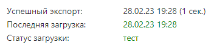

---
layout: default
title: 
---

# 

После того, как вами была успешно произведена , а статус загрузки сменился на “тест”, можно приступить к выгрузке данных во внешние системы.

Экспорт начнется по нажатию кнопки *“Выполнить”*.

❕Если вас интересует экспорт в JSON файл, вместо щелчка по кнопке *“Выполнить”,* следует нажать на находящиеся справа от нее три точки и выбрать из выпадающего списка *“Экспорт в файл”.*

После чего начнется скачивание файла на ваш компьютер.

Подробнее об остальных элементах выпадающего списка:

- **“Экспорт настроек”** - при нажатии на ваш компьютер будет скачан JSON файл хранящий в себе настройки текущего экспорта, в будущем этот файл может помочь облегчить работу по заполнению правил аналогичных экспортов.
- **“Импорт настроек”** - при нажатии потребуется выбрать и загрузить с вашего устройства JSON файл, хранящий в себе настройки правил экспорта, эти правила будут применены к текущему экспорту.

✔️ Вы успешно произвели экспорт данных.

